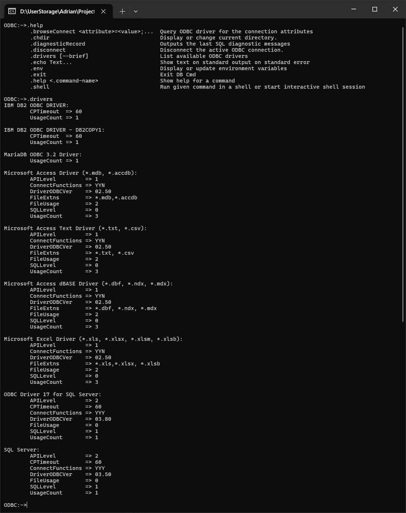

# ODBC Client
## ODBC client and tools

The project is still in developement and not really usable as of now. See [ODBC-GUI-Client](https://github.com/adrian-vasile-constantin/ODBC-GUI-Client)  repository for a working prototype.

The intent is to develop 3 components for working with ODBC:
  - a C++ client library: `odbc++`
  - a command line interpretter: `dbcmd`
  - a graphical client: `odbc-client`

## client library `odbc++`
Should simply translate the standard SQL/CLI (or [ODBC](https://learn.microsoft.com/en-us/sql/odbc/reference/syntax/odbc-api-reference?view=sql-server-ver16)) application programming interrface into C++ classes.

## command line interpretter `dbcmd`
Should be usable as a mini-shell that directly allows running SQL statements and provides dot-commands (like `.echo`) for connecting to a data source and for utility commands.

## grafical client `odbc-client`
Should allow end-users access to everything ODBC has to offer, like connecting to any data source or with any connection string, saving a new data source or a file DSN, running SQL queries on a connection, and browsing existing SQL functions, tables, views...

